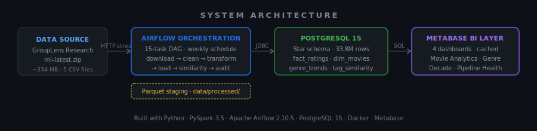
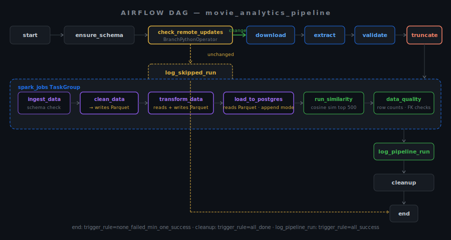
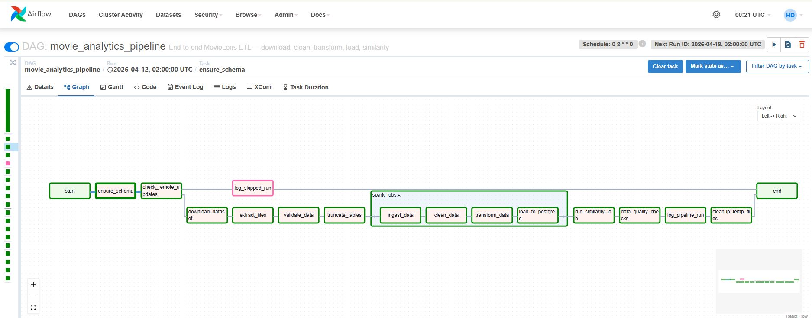
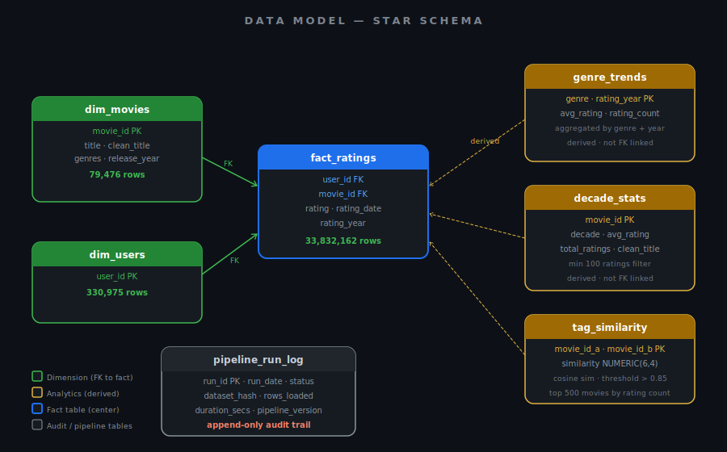
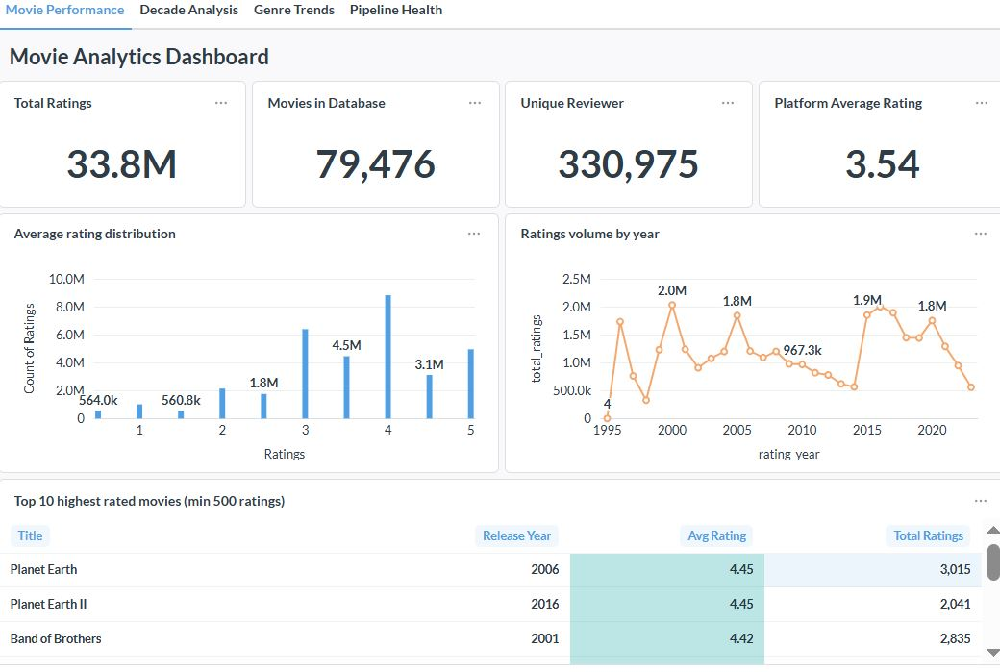
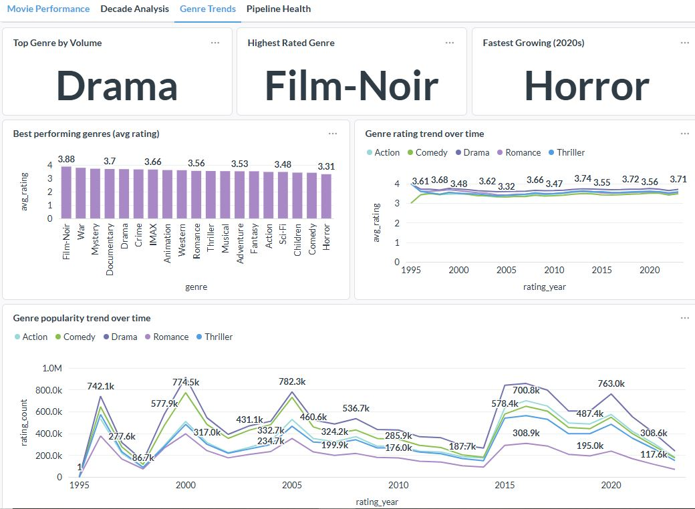
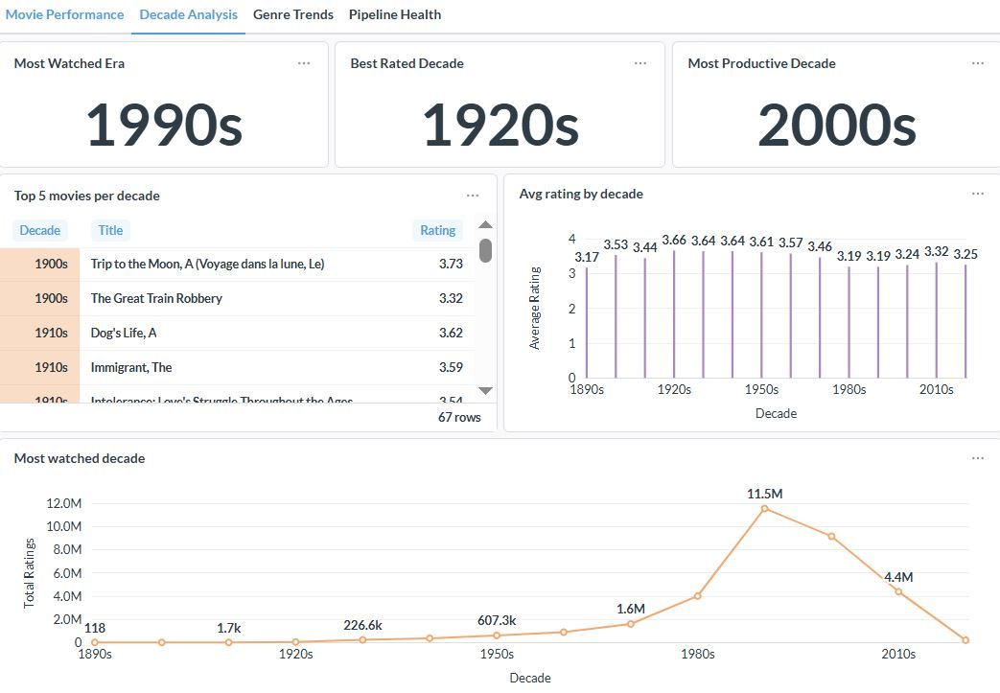
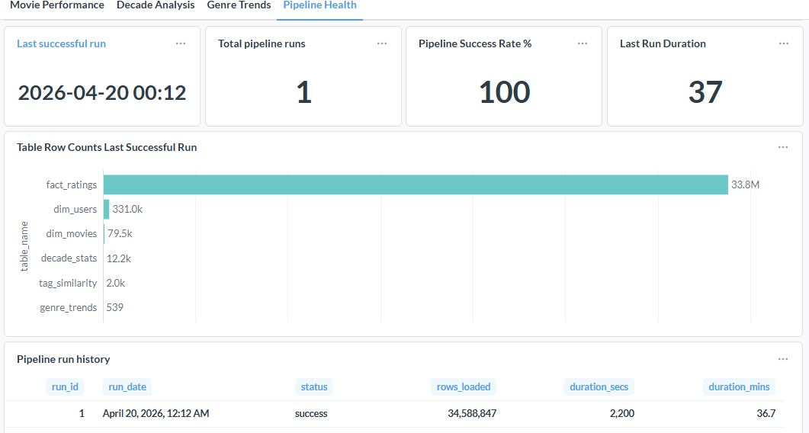

# 🎬 Spark ETL: Movie Analytics


> Production-grade, end-to-end data engineering pipeline processing **33.8 million MovieLens ratings** through a PySpark ETL workflow, orchestrated by Apache Airflow, persisted to a PostgreSQL star schema, and surfaced via Metabase dashboards — running weekly on a fully automated schedule with zero cloud cost.

---

## 📋 Table of Contents

- [Overview](#overview)
- [Architecture](#architecture)
- [Airflow Orchestration](#airflow-orchestration)
- [Tech Stack](#tech-stack)
- [Project Structure](#project-structure)
- [Data Pipeline Breakdown](#data-pipeline-breakdown)
- [Advanced Analytics](#advanced-analytics)
- [Setup & Installation](#setup--installation)
- [Usage](#usage)
- [Metabase Dashboards](#metabase-dashboards)
- [Data Quality & Monitoring](#data-quality--monitoring)
- [Results & Insights](#results--insights)
- [Challenges & Solutions](#challenges--solutions)
- [Future Improvements](#future-improvements)
- [Author](#author)

---

## Overview

### The Problem

Raw movie rating data from GroupLens arrives as flat CSV files with no schema enforcement, duplicate records, Unix timestamps, and pipe-separated genre strings. Without a structured pipeline:

- Processing is manual, inconsistent, and error-prone
- Reprocessing unchanged data wastes 45–90 minutes per run
- Results are inaccessible to non-technical stakeholders
- There is no audit trail, retry logic, or failure isolation

### The Solution

A 15-task Airflow DAG that automates the full lifecycle: **download → detect changes → extract → validate → truncate → process → load → similarity → quality check → log → clean up**. The pipeline uses remote metadata (ETag / Last-Modified / Content-Length) and MD5 hash-based change detection to skip full reloads when the source dataset has not changed, cutting execution time from 90 minutes to under 2 minutes on unchanged weeks.

A **Parquet staging layer** was introduced between the clean and load stages so that raw CSV data is parsed and cleaned only once per run. Transform and load tasks read from pre-computed Parquet files, eliminating redundant Spark sessions and reducing total memory pressure on a constrained local machine.

### Why It Matters

| Metric | Value |
|--------|-------|
| Ratings processed | 33,832,162 |
| Movies (post-cleaning) | 79,476 |
| Unique reviewers | 330,975 |
| Years of coverage | 1995 – 2023 |
| Airflow tasks | 15 |
| Cloud cost | $0 |
| Pipeline schedule | Weekly (Sunday 02:00 UTC) |

---

## Architecture



---

## Airflow Orchestration

### DAG: `movie_analytics_pipeline`



### DAG Graph View



*Graph view of a successful pipeline run*

### Key Design Decisions

**BranchPythonOperator replaces AirflowSkipException**
The original `check_remote_updates` raised `AirflowSkipException` to halt downstream tasks. This was replaced with `BranchPythonOperator` so the skip path is explicit and auditable. Both branches — full pipeline and skip — converge at `end`. Every scheduled run, whether it executes or skips, is now recorded in `pipeline_run_log`.

**Truncate as a separate task**
`truncate_tables()` runs as its own `PythonOperator` before `spark_jobs`. If truncate succeeds but Spark fails mid-load, the DAG retries from the truncate step — the database is never left in a partially-loaded state. Previously, truncate lived inside the load task with no clean failure boundary.

**Parquet staging layer**
`task_clean` writes `clean_ratings.parquet` and `clean_movies.parquet` to `data/processed/`. `task_transform` reads these, computes all three analytical outputs, and writes `movie_stats.parquet`, `genre_trends.parquet`, and `decade_stats.parquet`. `task_load` reads from Parquet only — raw CSV parsing happens exactly once per pipeline run.

**Skip branch audit logging**
`task_log_skipped_run` inserts a `status='skipped'` row into `pipeline_run_log` whenever the dataset is unchanged. This ensures every scheduled execution is traceable, making gaps or double-runs immediately visible in the Pipeline Health dashboard.

**XCom task ID constants**
All `xcom_pull` calls reference module-level constants (`TASK_VALIDATE`, `TASK_LOAD`, `TASK_QC`) rather than inline strings, so a task rename cannot silently break audit logging.

**Idempotency**
All pipeline output tables are truncated before any data is written. Re-running the pipeline any number of times produces identical results. `pipeline_run_log` and `pipeline_table_stats` are the only append-only tables.

**Retry policy**
```python
default_args = {
    'retries': 2,
    'retry_delay': timedelta(minutes=10),
    'retry_exponential_backoff': True,
}
```

### Task Groups

| Group | Tasks | Purpose |
|-------|-------|---------|
| Setup | `start`, `ensure_schema` | Self-bootstrapping schema creation |
| Branch | `check_remote_updates` | Remote metadata check, route to run or skip |
| Acquisition | `download_dataset`, `extract_files`, `validate_data`, `truncate_tables` | Download, extraction, validation, pre-load truncation |
| Processing | `spark_jobs.*` (4 tasks) | PySpark ETL with Parquet staging |
| Analytics | `run_similarity_job` | Cosine similarity on genome tag vectors |
| Monitoring | `data_quality_checks`, `log_pipeline_run`, `log_skipped_run`, `cleanup_temp_files` | QA, audit, cleanup |

---

## Tech Stack

| Technology | Version | Role | Justification |
|-----------|---------|------|---------------|
| Python | 3.12+ | Primary language | Ecosystem depth; PySpark compatibility |
| PySpark | 3.5.0 | Distributed processing | Handles 33M+ rows in partitions; scales to cluster without code changes |
| Apache Airflow | 2.10.5 | Orchestration | DAG-based dependencies, retry logic, XCom, task grouping, BranchPythonOperator |
| PostgreSQL | 15 | Data warehouse | ACID compliance, JDBC support, Metabase-compatible |
| Docker Compose | v2 | Infrastructure | Reproducible environments; eliminates host dependencies |
| Metabase | Latest | BI / Dashboarding | No-code dashboard authoring; direct PostgreSQL connectivity |
| psycopg2-binary | 2.9.9 | DB driver | Native PostgreSQL adapter for non-Spark tasks (schema, truncate, audit log) |

> **Why PythonOperator over SparkSubmitOperator?** This pipeline runs Spark in `local[2]` mode within the Airflow container. PythonOperator provides unified logging and zero additional configuration. SparkSubmitOperator is the correct choice for cluster deployments — documented as a future improvement.

> **Why Parquet for staging?** Parquet provides columnar compression, predicate pushdown, and schema preservation. Writing once after clean and reading multiple times (transform, load) is significantly faster than re-parsing 33M rows of CSV on each Spark stage.

---

## Project Structure

```
movie_analytics/
│
├── dags/
│   ├── movie_pipeline_dag.py        # 15-task Airflow DAG with branch logic
│   └── utils/
│       └── dataset_utils.py         # Download, metadata detection, DB helpers
│
├── jobs/
│   ├── spark_session.py             # SparkSession factory (local[2], memory-tuned)
│   ├── ingest.py                    # CSV → Spark DataFrames with explicit schemas
│   ├── clean.py                     # Dedup, null handling, type conversion, filtering
│   ├── transform.py                 # Window functions, genre trends, decade stats
│   ├── load.py                      # JDBC writes; reads from Parquet staging layer
│   └── similarity.py                # Cosine similarity on genome tag vectors
│
├── data/
│   ├── raw/                         # Extracted CSVs + metadata cache files
│   │   ├── .last_dataset_hash       # MD5 of last successfully processed zip
│   │   └── .last_dataset_meta.json  # ETag/Last-Modified/Content-Length cache
│   └── processed/                   # Parquet staging layer (written each run)
│       ├── clean_ratings.parquet
│       ├── clean_movies.parquet
│       ├── movie_stats.parquet
│       ├── genre_trends.parquet
│       └── decade_stats.parquet
│
├── sql/
│   ├── schema.sql                   # Star schema DDL + audit tables + indexes
│   └── create_databases.sql         # Creates airflowdb and metabasedb on first boot
│
├── assets/
├── architecture_dag.svg             # System architecture diagram
├── dag_flow.svg                     # Airflow DAG flow diagram
├── star_schema.svg                  # Data model diagram
├── dag_run_graph.JPG                # Airflow dag run
├── dashboard_movie_analytics.JPG    # Top-level KPIs — total ratings, movies, users, years of coverage
├── dashboard_genre_trends.JPG       # genre_trends table — avg rating by genre and year
├── dashboard_decade_analysis.JPG    # decade_stats table — rating patterns across decades
└── dashboard_pipeline_health.JPG    # pipeline_run_log — run history, duration, status       
│
├── docker-compose.yml               # PostgreSQL + Metabase + Airflow (all services)
├── Dockerfile                       # Custom Airflow image (Java 11 + PySpark + psycopg2)
└── README.md
```

---

## Data Pipeline Breakdown

### 1. Ingestion

Reads six CSV files using PySpark's `DataFrameReader` with **explicit schemas** — schema inference on 33M rows is slow and produces type errors on nullable columns.

```
ratings.csv       → 33.8M rows  (userId, movieId, rating, timestamp)
movies.csv        → 86,537 rows (movieId, title, genres)
tags.csv          → 2.3M rows   (userId, movieId, tag, timestamp)
genome-scores.csv → 18.5M rows  (movieId, tagId, relevance)
genome-tags.csv   → 1,128 rows  (tagId, tag)
```

### 2. Cleaning

| Operation | Applied To | Method |
|-----------|-----------|--------|
| Null removal | All required fields | `dropna(subset=[...])` |
| Deduplication | `(userId, movieId)` pairs | `dropDuplicates()` |
| Timestamp conversion | `ratings.timestamp` | `from_unixtime()` → `to_date()` |
| Release year extraction | `movies.title` | `regexp_extract(r'\((\d{4})\)')` |
| Genre parsing | `movies.genres` | `split('\\|')` → `ArrayType(StringType)` |
| Domain filtering | `ratings.rating` | Keep 0.5 – 5.0 only |
| Tag noise removal | `tags.tag` | Drop length < 2, lowercase, trim |
| FK integrity | `ratings → movies` | Anti-join: drop ratings for filtered-out movies |

> The FK integrity step was added after discovering that `clean_movies` filters out movies with `(no genres listed)`, leaving orphan `movie_id` values in `clean_ratings`. An inner join against `clean_movies` before writing `fact_ratings` eliminates all referential integrity violations at load time.

### 3. Transformation

Window functions compute analytics over the cleaned ratings:

```python
# Cumulative rating count per movie
Window.partitionBy('movieId').orderBy('rating_date')
      .rowsBetween(Window.unboundedPreceding, Window.currentRow)

# 30-day rolling average
Window.partitionBy('movieId')
      .orderBy(col('rating_date').cast('long'))
      .rangeBetween(-30 * 86400, 0)
```

All three computed DataFrames (`movie_stats`, `genre_trends`, `decade_stats`) are written to Parquet before the load task starts. The load task reads from Parquet using `load_analytics_from_parquet()` — no recomputation on load.

Column naming is normalised before writing: `movieId` → `movie_id` in `decade_stats` to match the PostgreSQL schema snake_case convention.

### 4. Data Modeling — Star Schema



### 5. Loading — PostgreSQL via JDBC

`fact_ratings` (33.8M rows) is written **year-by-year in 29 sequential batches** (1995–2023). All writes use `.mode('append')` — the dedicated `truncate_tables` task clears tables before Spark starts, so overwrite via JDBC (which issues `DROP TABLE`) is never needed and would violate PostgreSQL foreign key constraints.

```python
for i, year in enumerate(years):
    year_df = fact.filter(col('rating_year') == year).coalesce(2)
    write_table(year_df, 'fact_ratings', mode='append')
    print(f'    year {year} written ({i + 1}/{len(years)})')
```

`load_dimensions()` receives `clean_m` and `clean_r` DataFrames directly. `load_analytics_from_parquet()` reads from the Parquet staging layer — `run_all()` in `load.py` is retained for standalone debugging only and is never called by the DAG.

---

## Advanced Analytics

### Tag Genome Cosine Similarity

The genome dataset provides machine-computed relevance scores for **1,128 tags** across 18.5M `(movieId, tagId)` pairs. Each movie is represented as a vector in 1,128-dimensional tag space.

**Why cosine similarity?** It measures angular distance between vectors — invariant to the magnitude of relevance scores, which vary across movies with different review counts.

**Implementation:**
1. Filter to top 500 movies by rating count (feasible on local hardware)
2. Self-join genome scores on `tagId` to produce `(movie_a, movie_b, tag)` triples
3. Compute dot product and L2 norms per movie pair
4. Filter to pairs with `similarity > 0.85`
5. Write results to `tag_similarity` via `write_table()`

**Output:** A content-based recommendation foundation — movies that are semantically similar in tag space, independent of genre labels or collaborative signals.

```sql
-- Find movies most similar to The Shawshank Redemption (movieId = 318)
SELECT m.clean_title, ts.similarity
FROM tag_similarity ts
JOIN dim_movies m ON ts.movie_id_b = m.movie_id
WHERE ts.movie_id_a = 318
ORDER BY ts.similarity DESC
LIMIT 10;
```

---

## Setup & Installation

### Prerequisites

| Requirement | Notes |
|-------------|-------|
| Docker Desktop | Enable WSL2 backend on Windows |
| Docker Compose v2 | Included with Docker Desktop |
| Git | Any version |
| 8 GB RAM (minimum) | Assign 5 GB to Docker in Docker Desktop settings |

> Java and Python are installed inside the Docker containers — no host installation required.

### Step 1 — Clone the repository

```bash
git clone https://github.com/gogoharrison/spark-etl-movie-analytics.git
cd spark-etl-movie-analytics
```

### Step 2 — Build the custom Airflow image

The Dockerfile installs Java (required for PySpark), PySpark 3.5.0, and psycopg2-binary on top of the base Airflow 2.10.5 image.

```bash
docker compose build
# First build takes 10–20 minutes. Layers are cached for subsequent runs.
```

### Step 3 — Start all services

```bash
docker compose up -d
```

### Step 4 — Create the additional databases

The Postgres container creates `moviedb` automatically. `airflowdb` and `metabasedb` must be created manually on first setup (the `create_databases.sql` script runs automatically only on a fresh volume):

```bash
docker exec -it movie_postgres psql -U movieuser -d postgres -c "CREATE DATABASE airflowdb OWNER movieuser;"
docker exec -it movie_postgres psql -U movieuser -d postgres -c "CREATE DATABASE metabasedb OWNER movieuser;"
```

### Step 5 — Verify all services are healthy

```bash
docker compose ps
# Expected:
# movie_postgres           healthy    0.0.0.0:5433->5432/tcp
# movie_airflow_webserver  running    0.0.0.0:8080->8080/tcp
# movie_airflow_scheduler  running
# movie_metabase           running    0.0.0.0:3000->3000/tcp
```

### Step 6 — Access the services

| Service | URL | Credentials |
|---------|-----|-------------|
| Airflow UI | http://localhost:8080 | admin / admin |
| Metabase | http://localhost:3000 | Set up on first visit |
| PostgreSQL | localhost:5433 | movieuser / movie123 / moviedb |

**Connecting Metabase to PostgreSQL on first launch:**

| Field | Value |
|-------|-------|
| Database type | PostgreSQL |
| Host | postgres |
| Port | 5432 |
| Database | moviedb |
| Username | movieuser |
| Password | movie123 |

---

## Usage

### Trigger the pipeline

**Via Airflow UI:**
1. Navigate to http://localhost:8080
2. Find `movie_analytics_pipeline` in the DAG list
3. Toggle the DAG on (blue switch)
4. Click **▶ Trigger DAG** to run immediately

**Via CLI:**
```bash
docker exec -it movie_airflow_scheduler \
  airflow dags trigger movie_analytics_pipeline
```

### Monitor execution

The Airflow Graph view shows real-time task status. Click any task → **Log** for full output including Spark row counts and JDBC write progress.

| Colour | Meaning |
|--------|---------|
| Green | Task succeeded |
| Blue | Task currently running |
| Red | Task failed — check logs |
| Pink | Task skipped (skip branch taken) |

### Test individual tasks

```bash
# Syntax
docker exec -it movie_airflow_scheduler \
  airflow tasks test movie_analytics_pipeline <task_id> 2024-01-01

# Examples — run in this order on a fresh setup
airflow tasks test movie_analytics_pipeline ensure_schema 2024-01-01
airflow tasks test movie_analytics_pipeline check_remote_updates 2024-01-01
airflow tasks test movie_analytics_pipeline download_dataset 2024-01-01
airflow tasks test movie_analytics_pipeline extract_files 2024-01-01
airflow tasks test movie_analytics_pipeline validate_data 2024-01-01
airflow tasks test movie_analytics_pipeline truncate_tables 2024-01-01
airflow tasks test movie_analytics_pipeline spark_jobs.ingest_data 2024-01-01
airflow tasks test movie_analytics_pipeline spark_jobs.clean_data 2024-01-01
airflow tasks test movie_analytics_pipeline spark_jobs.transform_data 2024-01-01
airflow tasks test movie_analytics_pipeline spark_jobs.load_to_postgres 2024-01-01
airflow tasks test movie_analytics_pipeline run_similarity_job 2024-01-01
airflow tasks test movie_analytics_pipeline data_quality_checks 2024-01-01
```

> `airflow tasks test` runs the task callable directly without checking dependencies. It does not mark the task as succeeded in the metadata DB — safe to run at any time without affecting DAG state.

### Query results directly

```bash
docker exec -it movie_postgres psql -U movieuser -d moviedb
```

```sql
-- Row counts across all tables
SELECT 'fact_ratings'   AS tbl, COUNT(*) FROM fact_ratings   UNION ALL
SELECT 'dim_movies',           COUNT(*) FROM dim_movies      UNION ALL
SELECT 'dim_users',            COUNT(*) FROM dim_users       UNION ALL
SELECT 'genre_trends',         COUNT(*) FROM genre_trends    UNION ALL
SELECT 'decade_stats',         COUNT(*) FROM decade_stats    UNION ALL
SELECT 'tag_similarity',       COUNT(*) FROM tag_similarity;

-- Top 10 highest-rated movies (500+ ratings)
SELECT m.clean_title, ROUND(AVG(f.rating), 2) AS avg_rating, COUNT(*) AS total
FROM fact_ratings f JOIN dim_movies m ON f.movie_id = m.movie_id
GROUP BY m.clean_title HAVING COUNT(*) >= 500
ORDER BY avg_rating DESC LIMIT 10;

-- Pipeline run history
SELECT run_id, run_date, status, rows_loaded,
       ROUND(duration_secs / 60.0, 1) AS duration_mins
FROM pipeline_run_log ORDER BY run_date DESC LIMIT 10;

-- Table stats from last successful run
SELECT pts.table_name, pts.row_count
FROM pipeline_table_stats pts
JOIN pipeline_run_log prl ON pts.run_id = prl.run_id
WHERE prl.run_id = (
    SELECT run_id FROM pipeline_run_log
    WHERE status = 'success' ORDER BY run_date DESC LIMIT 1
)
ORDER BY pts.row_count DESC;
```

---

## Metabase Dashboards

### Dashboard 1 — Movie Analytics


KPI cards: Total Ratings · Movies in Database · Unique Reviewers · Platform Avg Rating

Charts:
- Ratings volume by year (bar chart, 1995–2023)
- Rating distribution 0.5–5.0 (bar chart)
- Top 10 highest rated movies — min 500 ratings (table)

---

### Dashboard 2 — Genre Trends


KPI cards: Top Genre by Volume · Highest Rated Genre · Fastest Growing Genre (2020s)

Charts:
- Genre popularity trend over time — Drama, Comedy, Action (multi-line chart)
- Best performing genres by average rating (horizontal bar chart)

---

### Dashboard 3 — Decade Analysis


KPI cards: Best Rated Decade · Most Watched Era · Most Productive Decade

Charts:
- Average rating by decade (bar chart)
- Top 5 movies per decade (table with decade pill badges)

---

### Dashboard 4 — Pipeline Health


KPI cards: Last Successful Run · Total Pipeline Runs · Success Rate · Last Run Duration

Charts:
- Table row counts from last successful run (horizontal bar chart)
- Pipeline run history with status (table)

---

## Data Quality & Monitoring

### Pre-load validation (`validate_data` task)

| Check | Threshold | Failure action |
|-------|-----------|---------------|
| Required files present | All 5 CSVs in `data/raw/` | `FileNotFoundError` → pipeline aborts |
| Ratings row count | ≥ 1,000,000 rows | `ValueError` → pipeline aborts |

### Post-load validation (`data_quality_checks` task)

| Check | Method |
|-------|--------|
| Row count > 0 per table | `SELECT COUNT(*)` per output table |
| fact_ratings ≥ 90% of raw count | Compares against `validate_data` XCom value |
| No NULL primary keys | Explicit NULL checks on `movie_id`, `user_id` |
| No orphan foreign keys | LEFT JOIN checks on `fact_ratings → dim_movies/dim_users` |
| Similarity values in [0, 1] | `MIN` / `MAX` check on `tag_similarity.similarity` |
| Row count drift ≥ 20% vs prior run | Compares against `pipeline_table_stats` from last run |

### Audit trail

`pipeline_run_log` is **append-only** — never truncated. Every execution, including skipped runs, produces a row with `status` of `success` or `skipped`. `pipeline_table_stats` records per-table row counts for each run, enabling drift detection across weeks.

### Recovering from failures

```bash
# Via Airflow UI: click the failed task → Clear → Confirm
# Via CLI:
docker exec -it movie_airflow_scheduler \
  airflow tasks clear movie_analytics_pipeline -t <task_id> -s 2024-01-01
```

Because `truncate_tables` runs before `spark_jobs`, clearing and re-running the load task is always safe — the truncate task re-runs first, ensuring no partial data survives from a previous failed attempt.

---

## Results & Insights

| Analytical Output | Finding |
|-------------------|---------|
| Rating volume by genre | Drama and Comedy dominate rating counts by a significant margin across all years |
| Genre quality vs popularity | Film-Noir and War genres carry the highest average ratings despite lower total volumes |
| Decade analysis | 1990s films carry the highest cumulative average rating; 2000s produced the most movies |
| Most rated film | The Shawshank Redemption — highest average rating with 97,999+ ratings |
| Pipeline efficiency | Remote metadata detection reduces unchanged-week execution from ~90 min to ~2 min |
| Content similarity | Genome-based cosine similarity identifies semantically related films independent of genre labels |

---

## Challenges & Solutions

| Challenge | Root Cause | Solution |
|-----------|-----------|----------|
| FK violation on `dim_movies` drop | Spark `.mode('overwrite')` issues `DROP TABLE`, blocked by FK from `fact_ratings` | Changed all JDBC writes to `.mode('append')`; truncation handled by dedicated `truncate_tables` task |
| FK violation on `fact_ratings` insert | `clean_movies` filters no-genre movies; orphan `movie_id` values remained in `clean_ratings` | Added inner join (anti-join) in `load_fact_ratings()` against `clean_movies` before writing |
| `movieId` column not found in `decade_stats` | `compute_decade_stats()` returned `movieId` (camelCase); schema expects `movie_id` (snake_case) | Added `.withColumn('movie_id', col('movieId')).drop('movieId')` before Parquet write in `transform.py` |
| Triple re-cleaning of raw CSVs | `task_transform` and `task_load` each called `run_cleaning()` independently | Introduced Parquet staging layer: clean once, write to disk, read downstream |
| `truncate_tables` inside Spark session | If truncate succeeded but Spark failed, DB was left empty with no rollback | Extracted to a separate task before `spark_jobs`; each retry re-truncates cleanly |
| Skip runs not audited | `AirflowSkipException` bypassed `log_pipeline_run` entirely | Replaced with `BranchPythonOperator`; added `log_skipped_run` on the skip branch |
| JVM OOM during `fact_ratings` write | Writing 33M rows in a single JDBC call exhausted container heap | Year-by-year batching in 29 sequential writes with `coalesce(2)` |
| Metabase `metabasedb` missing | Postgres only auto-creates `moviedb`; Metabase crashed on startup | Added `create_databases.sql` to `./sql/`; manual `CREATE DATABASE` for existing volumes |
| `psycopg2` missing in container | Not installed in base Airflow image; every non-Spark task failed | Added `psycopg2-binary==2.9.9` to `Dockerfile` |
| Slow dashboard queries on 33.8M rows | Full table scans on `fact_ratings` for every Metabase load | Added composite indexes on `(rating)`, `(rating_year, rating)`, `(user_id, movie_id)`; enabled Metabase query caching |
| WSL2 memory exhaustion on Windows | Docker limited to 3.7 GB on 8 GB host | `.wslconfig`: `memory=5GB`, `swap=4GB`; Spark driver memory reduced to `1500m` |
| `localhost:5433` vs `postgres:5432` | `load.py` used host-mapped port, unreachable inside Docker network | Env-var driven config: `JDBC_URL=jdbc:postgresql://postgres:5432/moviedb` inside containers |

---

## Future Improvements

- **Cloud deployment** — Migrate to Kubernetes with `SparkSubmitOperator`, object storage (S3/GCS) for raw data, and a managed PostgreSQL instance. The pipeline logic requires no changes.
- **True incremental loading** — Replace full-reload strategy with timestamp-watermark incremental loading if GroupLens introduces a delta feed endpoint.
- **dbt transformation layer** — Replace PySpark transform jobs with dbt models for SQL-based transformations with schema tests, documentation, and lineage tracking.
- **Great Expectations** — Add declarative data quality contracts with automated alerting on threshold violations, replacing the current custom check implementation.
- **Collaborative filtering** — Extend the similarity model to user-based collaborative filtering using the full 33M-row ratings matrix.
- **Real-time streaming** — Add a Kafka ingestion layer for live rating event processing alongside the batch pipeline.
- **Prometheus + Grafana** — Replace `pipeline_run_log` with real-time pipeline metrics dashboards.
- **SparkSubmitOperator** — Migrate Spark tasks from `PythonOperator` to `SparkSubmitOperator` for cluster-ready deployment.

---

## Author

**Gogo Harrison**
Data Engineer | Data Scientist | ML Engineer

Specialising in e-commerce analytics, customer behaviour modelling, and production-grade data pipeline development.

[](https://linkedin.com/in/gogo-harrison)
[](https://github.com/gogoharrison)

---

<div align="center">

**Built with Python · PySpark · Apache Airflow · PostgreSQL · Docker · Metabase**

*Production-grade data engineering — zero cloud cost.*

</div>
